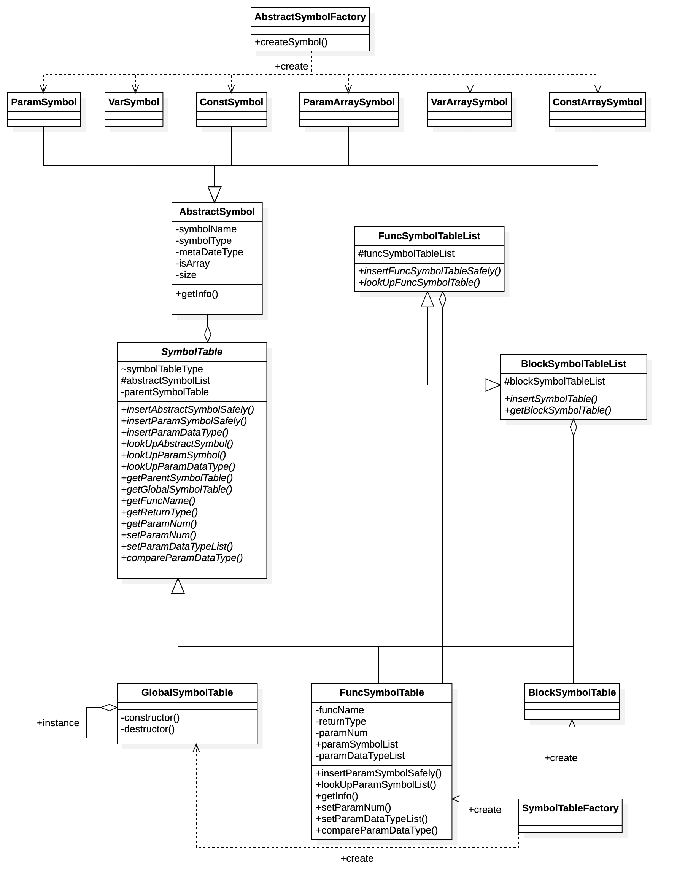

# 编译原理研讨课实验PR002实验报告

[author]: 高梓源 官奕琳 [Stu.Num]: 2019K8009929026 2019K8009907026

[TOC]

## 任务说明

本次实验首先需要完成CACT语言符号表的设计和操作处理。

利用符号表在PR001的基础上实现对CACT语言进行语义分析和类型检查，对于语义错误能进行相应的处理，即对于符合语义规范的.cact文件，编译器返回0，对于有语义错误的.cact文件，编译器返回非0值。

## 成员组成

- 高梓源，2019K8009929026
- 官奕琳，2019K8009907026
## 实验设计

### 设计思路

#### 符号表设计

参考[Geeks](https://www.geeksforgeeks.org/symbol-table-compiler/)所述，符号表应包含：

- 变量，常量名
- 过程和函数名
- 字面量和字符串
- 中间变量名
- 源语言中标签

参考[SIT](https://www.sitsitamarhi.ac.in/wp-content/uploads/2020/05/file_5eaf089be4138.pdf)中所述，符号表元数据应该存储：

- 数据类型
- 作用域
- 相关信息
- 属性

上述描述只是有了初步的概念，我们结合CACT的应用实例思考符号表如何组织。

- 首先站在顶层，需要有一个**全局符号表`globalSymbolTable`**，存储**全局变量**和**函数符号表列表**
- 而后函数符号表中面向函数内部符号信息，需要存储**参数符号、指代符号、块符号表列表**
- 而语句中的块结构需要存储内部定义的**局部变量符号**与**下一层的块结构列表**

在C语言中通常组织符号表有以下数据结构：

- 普通的数组
- 链表
- 哈希表
- 二叉搜索树

都是只针对元符号（指代符号）存储查找的过程，可以将各种符号列成大表，丰富记录信息，各符号表各取所需。但是C++的面向对象特性机遇了符号表更多可能的设计。

首先明确一下上面可能已经用到的相关名词：

- 指代符号：使用Ident进行匹配的，用以指代值的抽象符号
- 块结构：函数内部语句中使用成对大括号括起的若干条语句，对应词法中block
- 声明：只声明类型，不定义实现，CACT中只适用于函数声明
- 定义：定义指代符号的值，定义函数的实现。CACT specification中指出“*未显式初始化的整型和浮点型变量/常量/数组被默认初始化为0*”，因此所有变量的声明都可以直接视为定义其值为0。

接下来根据UML类图详细叙述设计：

##### 指代符号

首先从最基本的元素开始，作为指代值的抽象符号，根据指代内容可以划分为6种：参数符号、变量符号、常量符号、参数数组、变量数组、常量数组。

此处我们的设计是提取其共性组成父类`AbstractSymbol`，共性为符号名称、符号类型、元数据类型、是否是数组、大小，符号类型和是否是数组决定了上述6种指代符号中采用哪种进行实例化，为实例化的方便，我们采用简单工厂模式（兼顾了面向对象特性和时间复杂度），定义`AbstractSymbolFactory`及其静态方法`createSymbol`。此外，确定一个指代符号还依赖的信息是元数据类型和大小，前者为`int, bool`等CACT基本数据类型，后者保存数组大小。

采用一个复杂的例子：`int array[10];`，该语句定义了一个整形数组变量，大小为10，要想唯一确定这个符号必须存储：`数组名`、`变量`、`整型`、`数组`、`大小为10`这五条信息，虽然按照CACT语言规范，查找时只需要数组名这一条信息，但其他信息在进行类型判断时尤为重要。

(C++)面向对象的另一个核心要素在于访问控制，我们这里默认所有符号在定义的时候就已经确定类型，之后在相同作用域内不可以二次定义。因此设置`AbstractSymbol`或其子类信息的唯一手段是通过构造函数，此处只提供`const`类型（若对类成员有修改在编译阶段会报错）的`get`方法。

##### 符号表列表

从UML图及前面的叙述中可以了解到准备了三类符号表：全局符号表、函数符号表、块结构符号表，全局符号表唯一，后两者都不唯一，他们在parent符号表中需要以列表的形式出现，此外在每个符号表中都需要包含指代符号组成的列表，函数符号表中还需要参数指代符号的列表。函数符号表还做了一个更加便捷的功能：为方便调用函数时判断调用是否正确，只对参数类型做了一个列表，调用时直接根据下标索引参数类型即可。因此共五种列表结构。

为了加速访问，考虑五种列表结构适合的数据结构。注意到在语法分析扫描的过程中，往往是利用符号名进行匹配和查找，因此自然想到使用hash table。那么拥有唯一名称可以使用hash table的列表结构是`AbstractSymbolList, ParamSymbolList, FuncSymbolTableList`，剩下的块结构和参数类型列表无法使用此结构表达，而且事实上并不需要对他们进行名称查找的操作。C++中Hash table为STL库`unordered_map`，剩下的使用`vector`即可。根据需求，符号表列表基本都提供插入和查找操作。

##### 符号表

符号表设计依然采用面向父类，这里有过权衡，因为三种符号表事实上共性不多，但因为有一个需求是必须在符号表中提供parent符号表指针，因此采用统一的父类，否则在表示该符号表指针时还需要额外的信息表明它的类型；此外关于子类中并不存在的功能若在面向父类时被调用，在C++中也能得到较为合理的返回措施或编译报错。

因此采用父类`SymbolTable`，三个子类`GlobalSymbolTable, FuncSymbolTable, BlockSymbolTable`。此外重要的是本次运用OOP采用了一个突破，传统上而言，*组合优于继承*，但是C++面向对象具有多继承的特性，这赋予了OOP一些不同的开拓思路。因为如果是组合关系，使用者需要完全接受组合件函数的所有功能，而采用多继承，而不是java中的单继承多接口，C++中子类可以在多个父类中各取所长，而且可以自由重写组件的函数功能，自由度更高。基于这样的考虑，`SymbolTable`继承了`FuncSymbolTableList, BlockSymbolTableList`，而指代符号的两个list(`AbstractSymbolList, ParamSymbolList`)由`SymbolTable`本身来实现即可，因为`ParamSymbolList`只在`FuncSymbolTable`中可能需要重写，因此在其父类`SymbolTable`中采用组合关系页未尝不可。`GlobalSymbolTable`需要保证全局只有一个，采用单例模式。

为了加速访问，和重写的需求，将各个`List`设置为protected属性。

函数接口主要提供五种：`insert, lookUp, get, set, compare`，父类中皆为虚函数(`virtual`)，但有些进行实现。面向对象中值得利用的一个特性为代码重用，就体现在此处，若无修改必要，直接使用父类模版。但是，若有些函数接口是某个子类特有的，在父类中进行直接返回式实现，在子类中`override`，函数所需要的成员变量只需要定义在子类中，若某个函数需要每个子类不同实现，则直接在最后加`const = 0`，每个子类`override`，否则子类未能实现则编译器报错（但本次试验没有这类情况）。

### 实验实现

#### 枚举类型

首先先定义了几个枚举class，用以表述类型更加方便

- `SymbolTable`: `PARAM, VAR, CONST`
- `TableType`: `GLOBAL, FUNC, BLOCK`
- `MetaDataType`: `VOID, BOOL, INT, FLOAT, DOUBLE`

#### 指代符号

##### 函数接口

|类|函数名|参数|返回类型|说明|
|:-:|:-:|:-:|:-:|:-:|
|`AbstractSymbol`|`getSymbolName`|`void`|`string`|返回符号名称|
|`AbstractSymbol`|`getSymbolType`|`void`|`SymbolType`|返回符号名称|
|`AbstractSymbol`|`getMetaDataType`|`void`|`MetaDataType`|返回符号名称|
|`AbstractSymbol`|`getIsArray`|`void`|`bool`|返回符号名称|
|`AbstractSymbol`|`getSize`|`void`|`size_t`|返回符号名称|
|`ParamSymbol`|`ParamSymbol`|`string, SymbolType, MetaDataType, bool, size_t`|`void`|构造函数，直接设置符号信息|
|`VarSymbol`|`VarSymbol`|同上|`void`|构造函数|
|`ConstSymbol`|`ConstSymbol`|同上|`void`|构造函数|
|`ParamArraySymbol`|`ParamArraySymbol`|同上|`void`|构造函数|
|`VarArraySymbol`|`VarArraySymbol`|同上|`void`|构造函数|
|`ConstArraySymbol`|`ConstArraySymbol`|同上|`void`|构造函数|
|`AbstractSymbol`|`AbstractSymbol`|同上|`void`|构造函数|

用基类表述的函数在子类中都可以直接使用，面向父类时采用最下定义。

#### 符号表列表

##### 函数接口

|类|函数名|参数|参数类型|返回类型|说明|
|:-:|:-:|:-:|:-:|:-:|:-:|
|`FuncSymbolTableList`|`insertFuncSymbolTableSafely`|`inFuncName, inReturnType`|`string, MetaDataType`|`SymbolTable *`|根据函数名和返回值新建一个函数符号表加入列表（查重），若成功返回加入的函数符号表指针|
|`FuncSymbolTableList`|`insertFuncSymbolTableSafely`|`inFuncName, inReturnType, inParentSymbolTable`|`string, MetaDataType, SymbolTable *`|`SymbolTable *`|根据函数名和返回值新建一个函数符号表加入列表（查重），若成功返回加入的函数符号表指针|
|`FuncSymbolTableList`|`lookUpFuncSymbolTable`|`inFuncName`|`string`|`SymbolTable *`|根据函数名和返回值新建一个函数符号表加入列表（查重），若成功返回加入的函数符号表指针|
|`BlockSymbolTableList`|`insertBlockSymbolTable`|`inParentSymbolTable`|`SymbolTable *`|`SymbolTable *`|新建一个块结构符号表并加入列表，填入块符号表的父符号表，若成功返回新加入的符号表指针|
|`BlockSymbolTableList`|`getBlockSymbolTable`|`index`|`int`|`SymbolTable *`|根据下标返回块符号表指针，若输入不合法则报错|

#### 符号表

##### 函数接口

使用基类`SymbolTable`定义的函数在子类中都可以直接调用，使用子类定义的函数为该子类特有，其余函数不允许调用。

|类|函数名|参数|参数类型|返回类型|说明|
|:-:|:-:|:-:|:-:|:-:|:-:|
|`SymbolTable`|`insertAbstractSymbolSafely`|`inSymbolName, inSymbolType, inMetaDataType,inIsArray, inSize`|`string, SymbolType, MetaDataType, bool, size_t`|`AbstractSymbol *`|利用所给参数带查重地插入指代符号列表，若成功返回指代符号指针|
|`SymbolTable`|`lookUpAbstractSymbol`|`inSymbolName`|`string`|`AbstractSymbol *`|利用指代符号名称查找之，**注意会逐级向上查找，找到存在对应符号的最下嵌套作用域**|
|`SymbolTable`|`getParentSymbolTable`|`void`|`void`|`SymbolTable *`|找到本符号表的父符号表|
|`SymbolTable`|`getGlobalSymbolTable`|`void`|`SymbolTable *`|本意只是为了全局符号表单例模式提供，但理论而言确实可以被外部和子类访问|
|`SymbolTable`|`setParameterSymbolTable`|`parentSymbolTable`|`SymbolTable *`|`bool`|为了弥补，若此前构造函数未能提供父符号表，则可调用此函数定义|
|`SymbolTable`|`compareAbstractSymbolDataType`|`inSymbolName, inSymbolType, inMetaDataType, inIsArray, inSize`|`string, SymbolType, MetaDataType, bool, size_t`|`bool`|比较变量名的相关属性和传入属性是否相同，确定该变量是否类型和要求完全一致|
|`FuncSymbolTable`|`FuncSymbolTable`|`inFuncName, inReturnType, inParentSymbolTable`|`string, MetaDataType, SymbolType *`|`void`|构造函数|
|`FuncSymbolTable`|`insertParamSymbolSafely`|`inSymbolName, inSymbolType, inMetaDataType, inIsArray, inSize`|`string, SymbolType, MetaDataType, bool, size_t`|`AbstractSymbol *`|根据所给参数信息新建参数指代符号，插入参数符号表，若成功，返回参数符号指针|
|`FuncSymbolTable`|`insertParamType`|`inSymbolType, inMetaDataType, inIsArray, inSize`|`SymbolType, MetaDataType, bool, size_t`|`bool`|根据所给参数信息新建参数指代符号，加入参数类型列表，成功时返回true|
|`FuncSymbolTable`|`getFuncName`|`void`|`void`|`string`|返回函数名|
|`FuncSymbolTable`|`getReturnType`|`void`|`void`|`MetaDataType`|返回函数返回类型|
|`FuncSymbolTable`|`getParamNum`|`void`|`void`|`int`|返回函数参数个数，注意需要先调用计算函数|
|`FuncSymbolTable`|`setFuncName`|`inFuncName`|`string`|`bool`|设置函数名，弥补构造函数缺漏|
|`FuncSymbolTable`|`setReturnType`|`inReturnType`|`MetaDataType`|`bool`|设置函数返回类型|
|`FuncSymbolTable`|`setParamNum`|`void`|`void`|`int`|设置参数个数，调用即可，内部自动计算|
|`FuncSymbolTable`|`setParamDataTypeList`|`void`|`void`|`void`|bool`|设置参数类型列表，调用即可，内部自动计算|
|`SymbolTableFactory`|`createSymbolTable`|`inTaleType`|`TableType`|`SymbolTable *`|工厂模式构造符号表类，暂不建议使用|

`GlobalSymbolTable`可以使用`SymbolTable`和`FuncSymbolTableList`中所有接口，`BlockSymbolTable`可以使用`SymbolTable`和`BlockSymbolTableList`中所有接口，`FuncSymbolTableList`可采用全部接口。

### 其它

## 总结

### 实验结果总结

### 分成员总结

